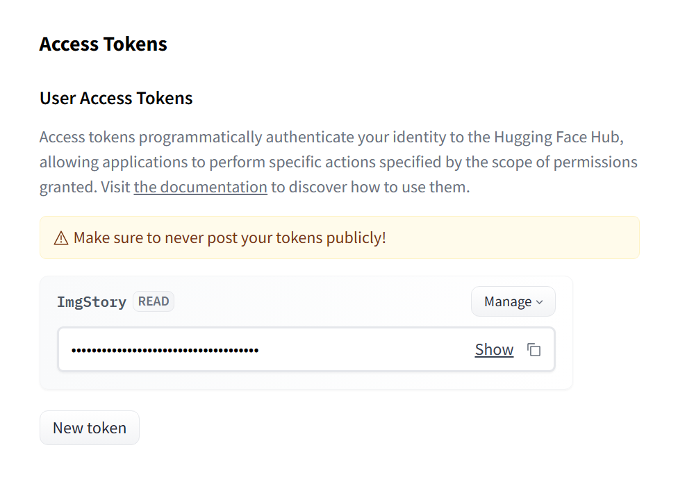

A AI chain or also know as a AI model chains refer to a series of connected AI models or algorithms used together to accomplish a specific task. For instance, in natural language processing, an AI chain could involve a sequence of models for tasks like text preprocessing, sentiment analysis, and text generation.

## Getting started

First before wey start we need to decide on a programming language to use. Here you can chose what ever you like. By for the sake of the post I`l be using Python. I can recommend following along but you may demised to use what ever you like. Most of the core concepts are the same for every language.

## Python & Tensorflow

Python is a high-level programming language that lets you work more efficiently and effectively whit AI and much more. If you are following along whit the post you will need to have python installed.

Download link: https://www.python.org/downloads/

After having Python installed on your machine we can proceed to installing Tensorflow. TensorFlow is an open-source library for creating and deploying machine learning models in various environments. If you are following along whit the post you will need to have Tensorflow installed.

Install link: https://www.tensorflow.org/install

## Huggingface

Hugging Face is an open source data science and machine learning platform. It serves as a hub for AI experts and enthusiasts, providing essential infrastructure for deploying, running, and training ML models. We are going to use hugging face to connect to all different types of AI's.

Link to sigh-up: https://huggingface.co/

After sighing up we can get our access token from: Settings -> Access Tokens



#### Transformers

🤗 Transformers provides APIs and tools to easily download and train state-of-the-art pretrained models. Using pretrained models can reduce your compute costs, carbon footprint, and save you the time and resources required to train a model from scratch.

Instalation

- Need a deep leanring library liek
  PyTorch installation instructions.
  TensorFlow 2.0 installation instructions.
  Flax installation instructions.

- Instal Transformers

```
pip install tensorflow
```

If you are having issues here is the link to the Huggingface installation:
https://huggingface.co/docs/transformers/installation

After setting up all of the nessasery programs and libraries we can get into programming.

## Using AI

To get us started lets see if everything is working

```
from transformers import pipeline

transcriber = pipeline(task="automatic-speech-recognition")
transcriber("https://huggingface.co/datasets/Narsil/asr_dummy/resolve/main/mlk.flac")
{'text': 'I HAVE A DREAM BUT ONE DAY THIS NATION WILL RISE UP LIVE UP THE TRUE MEANING OF ITS TREES'}
print(transcriber)
```

Run this code and see if the transformers library is working as it shoed. If it is you are all set up to embark on you AI journey. Have fun and never stop programming!

## Sources

Steps form:https://huggingface.co/docs/transformers/index

## More Reading Material

### Books:

_Pattern Recognition and Machine Learning_ By Christopher M. Bishop

_Deep Learning_ by Ian Goodfellow, Yoshua Bengio, and Aaron Courville

_Perceptrons: An Introduction to Computational Geometry_ by Marvin Minsky and Seymour Papert

_Neural Networks for Pattern Recognition_ by Christopher M. Bishop (1995)

### Videos

What is Hugging Face? (In about a minute) by Eye on Tech:
https://www.youtube.com/watch?v=jBFFUwL0TyY

AI vs Machine Learning by IBM:
https://www.youtube.com/watch?v=4RixMPF4xis

Stanford CS221: Learn AI:
https://www.youtube.com/playlist?list=PLoROMvodv4rO1NB9TD4iUZ3qghGEGtqNX
