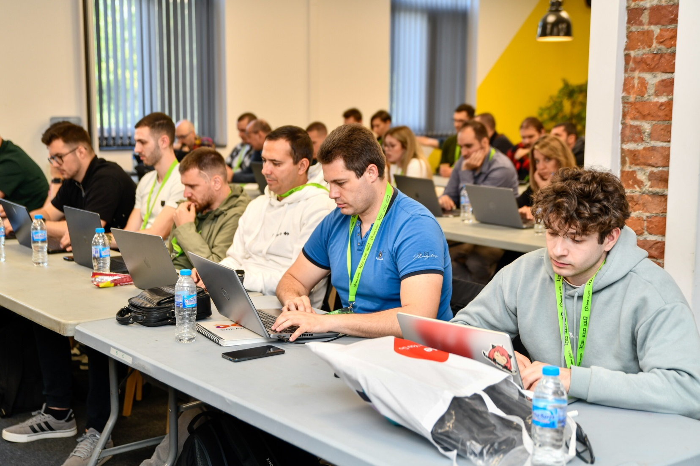
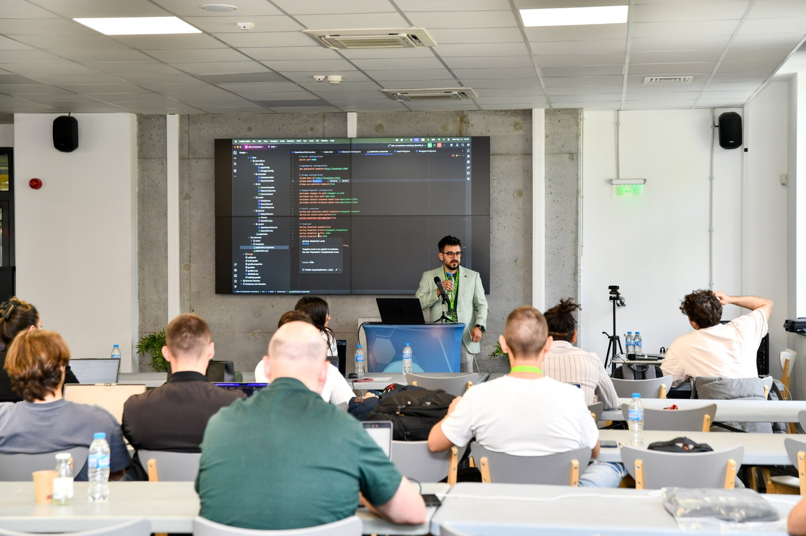
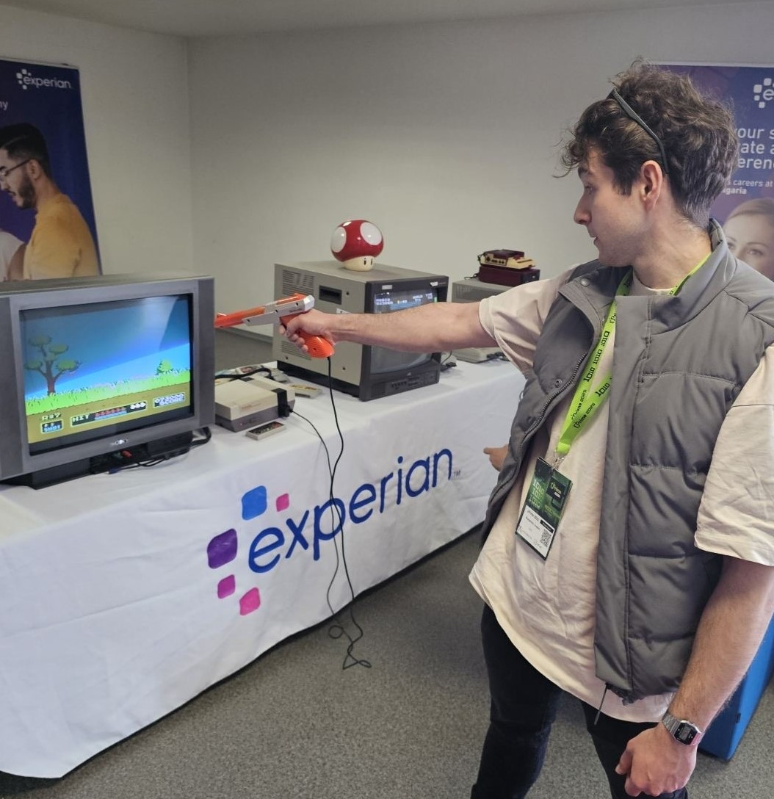

# Introduction

Hello again! This is my second year attending [jPrime](https://jprime.io/). jPrime is a conference featuring presentations on Java, other JVM-based languages, mobile and web development, as well as software development best practices. It is organized by the Bulgarian Java User Group and supported by some of the largest companies in Bulgaria. In this blog post, I’ll share my honest opinion of the event, as I was fortunate to receive a free ticket from my company, DXC.

# Agenda

I attended last year’s jPrime and had mixed feelings. The lectures were cool, the companies were interesting, and the attitude and energy from the speakers were contagious. However, the people attending the event were, honestly, kind of disappointing. The general attitude of some attendees came across as arrogant, and in my opinion, they treated the companies poorly. Of course, this is subjective.

As a junior dev, I had the time of my life. But I understand that for a senior developer who has attended many such events, it might feel cheesy or overly commercial. Last year, many of the lectures were either advertisements for software tools or Java-related talks like how to structure your code better, how to test effectively, handle threads, and more.

So, I approached this year more carefully when selecting which lectures and workshops to attend. The lectures were held in two halls, alongside running workshops. If you didn’t want to attend a particular lecture, you could switch to another one or join a workshop instead. The jPrime website was very helpful in planning what to attend. All sessions were described by the speakers themselves, which is both a good and a bad thing. If someone is there just to promote something, they might hide it behind catchy keywords. Still, kudos to the jPrime team for setting up a well-organized agenda panel on their website.

# Workshops

This year, I wanted to attend more workshops, mainly because listening to five or six lectures across two days can be mentally exhausting. So, I went to the first workshop on day one called **"Build your AI assistant with Ollama, LLM and Spring"** led by Valentin Vasilev. It was the first workshop of the event, and a lot of people showed up—the hall was full. But again, kudos to the jPrime team for organizing a bigger and much nicer space compared to last year. It was a godsend.

The workshop was solid. It included a long, well-thought-out guide written by Valentin Vasilev, and he personally helped anyone who had issues running the project. All in all, a very well-handled session, especially given the packed room.

The second workshop was a blast. I had a really good time at **"Brew Your Own Perplexity: A Java-Powered AI Recipe"** hosted by Ivo Stefanov. The goal was to build an AI chatbot that first searches the internet, then analyzes and reasons about the information. Ivo gave a great presentation. He started by providing a base Spring app that would call the AI, which could be any Ollama model participants preferred.

After setting up the base app and getting simple responses from the AI, the next step was integrating a search engine. This is where the real fun began. The integration was done through live coding, with prompts from both the participants and the host. While we didn’t quite get the search engine fully connected by the end, it was a fun and educational session. Later on, Ivo managed to complete the integration and uploaded the project to GitHub—a great gesture that shows he really cared about ensuring we got value from the workshop.

# Lectures

Over the course of the event, I only attended two lectures because I wanted to spend more time engaging with workshops and the companies at their booths. Fortunately, jPrime records all of their lectures, so even if you miss one, you can watch it later on [YouTube](https://www.youtube.com/@bgjug/videos).

One lecture I really wanted to attend was **"Architectures in Java: Making a choice and preserving integrity"** by Taner Ilyazov. It was a great talk about different architectural styles and how to choose the right one. I highly recommend giving it a [watch](https://www.youtube.com/watch?v=Q2Hh7RGuRSU&ab_channel=BulgarianJavaUserGroup).

# Companies with Booths

This year, there were some really interesting companies, and I had a blast talking to the technical people they brought along. If you're a company looking to better engage with the audience, please bring a Java geek from your office! The companies provided fun and interactive games—Java quizzes, puzzle challenges, word games, and agility tests. I loved all of them.

However, not many companies had open positions. And the ones that did were mostly hiring for roles in Sofia and primarily looking for senior developers. I think this reflects the current state of the job market. Still, it’s frustrating to see everything gated behind Sofia. I get that it’s the capital and home to many major companies, but my own company is based in Sofia and employs excellent programmers all across Bulgaria—not just "code monkeys."

# Games and Side Engagement

The event wasn’t just about lectures, workshops, and company booths. There was a lot of side engagement organized by the companies. DXC had a corner with a PS5 set up. Ocado had a tech demo you could interact with. I didn’t manage to check it out this year, but last year they brought a robot you could control to move objects into a cart.

The area I spent the most time in was the **retro game zone** set up by Experian. That was a godsend—a place to relax and play some old-school games. Keep it up, Experian!

# Final Thoughts

All in all, the event was a lot of fun. I had a great time talking to everyone at the booths and catching up with my colleagues from Sofia. The workshops were engaging, and the lectures I attended were far from boring. Bravo to the jPrime organizers—keep it up! We need more people like you taking the time to organize great events for those who truly appreciate them.

_All photos used in this blog post are from the event organizers._

If anyone recognizes themselves in the photos taken by the jPrime organizers and doesn’t want to appear in this blog post, please contact me at:

**ivailo.rumenov@outlook.com**
