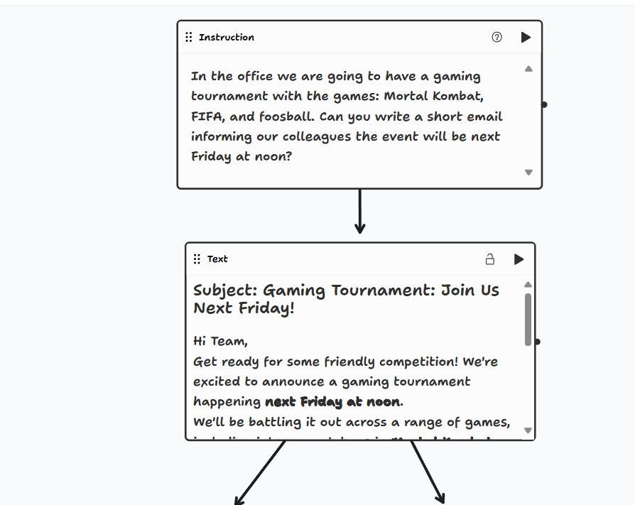
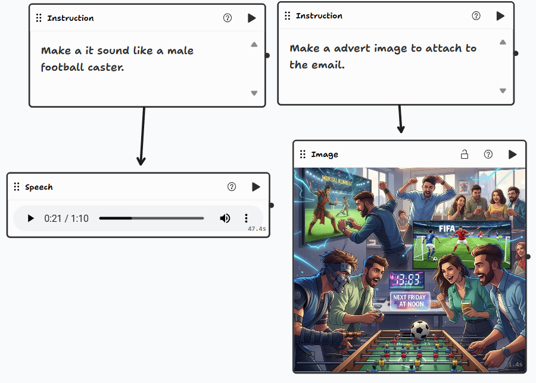

# Introduction

What Is a Tldraw Computer?

In the world of digital creativity and collaboration, Tldraw stands out as a powerful visual tool designed for sketching, diagramming, and prototyping ideas in real time. Basically, it’s an online app for making doodles. But what exactly is a Tldraw computer?

A Tldraw computer is an interactive way to play with AI. It combines all the tools for drawing and note-taking from Tldraw and merges them with Google’s Gen AI. At this point, they have implemented:

- Text
- Image
- Camera input
- Speech
- Website
- File
- Range
- Date

Most of these I haven’t used yet. However, this platform is so interesting and creative that you can spend time just playing around with the text and image generation. And when I say play, I really mean play. This is what AI was missing — a way to interact freely with a model. To plot out a program or design visually. To me, this is what AI is supposed to be. And to prove my point, here’s a quick demo to show what it’s all about.

---

# Demo

When creating this demo, I wanted to try solving a scenario that you might encounter in real life. Recently, at my job, we had a gaming tournament. So why not try to make some advertising materials to see how this platform can handle the task?

So how do you start? When using Tldraw, I tend to begin with an `instruction` node. This is your way of prompting something to happen or giving more context about what you want generated or calculated. The `instruction` node is your bread and butter.

For my task, I started with an `instruction` containing all the games in the tournament along with some guidelines. After creating an instruction, you connect it using arrows to another node. That’s the main selling point of this tool — you can connect whatever you want however you want.

So, for my task, I connected it to a text node, which generated the email text. From there, it split into two directions. This way, I could use one input for two different tasks: one for generating an image, and the other for generating TTS (text-to-speech).

Here are the visualizations:

Listen to the email being read aloud:

<audio controls>
  <source src="../../../public/blog/tldraw/tts_male_reading_email.wav" type="audio/wav">
  Your browser does not support the audio element.
</audio>

---

# Final Thoughts

This is a cool tool, and people have already made fantastic things with it. I’ll keep using it — for me, it’s a creative outlet to easily play around with AI.

If you’ve reached this part, please give it a shot. Here’s the link:

https://computer.tldraw.com/
