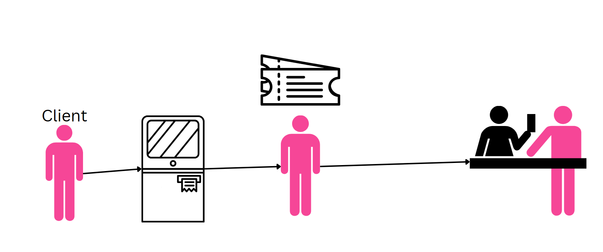
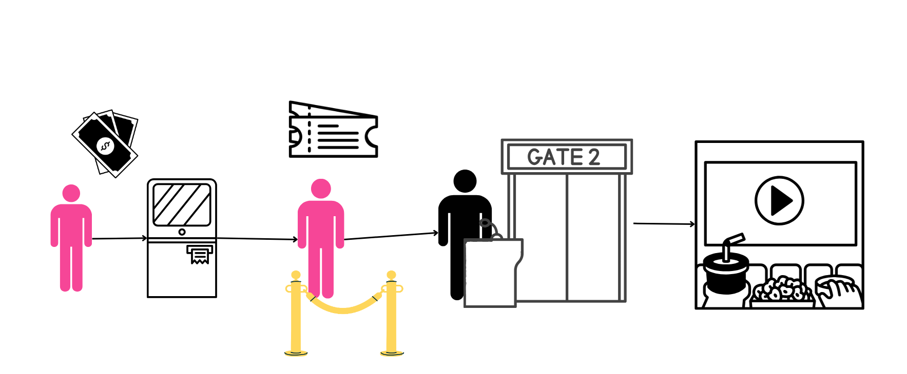
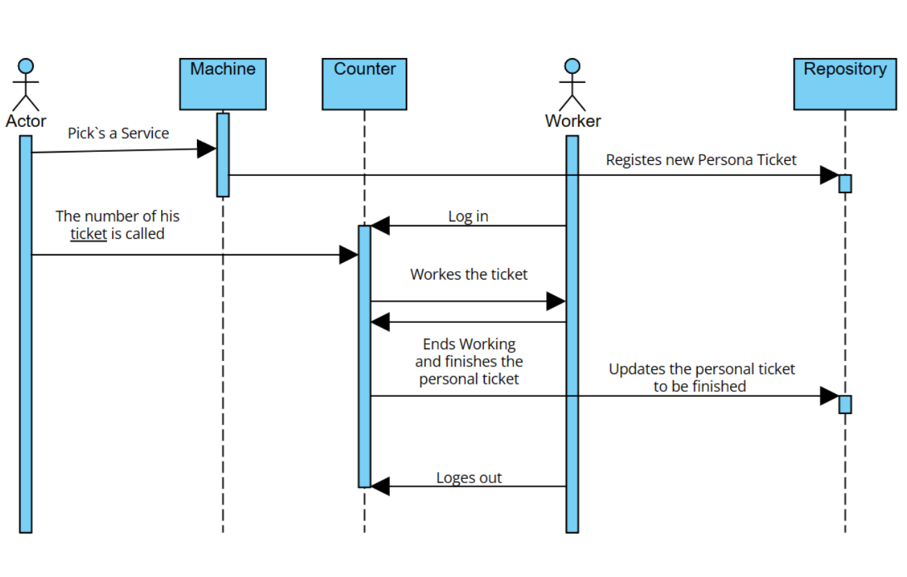
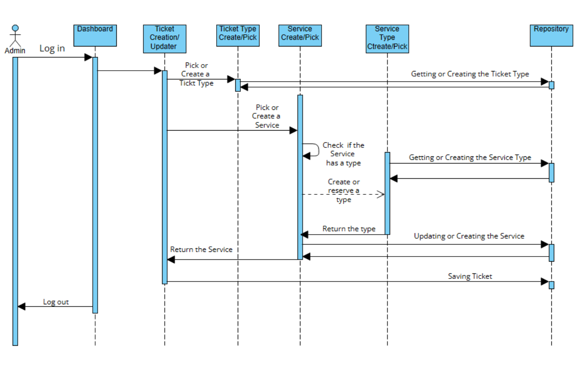
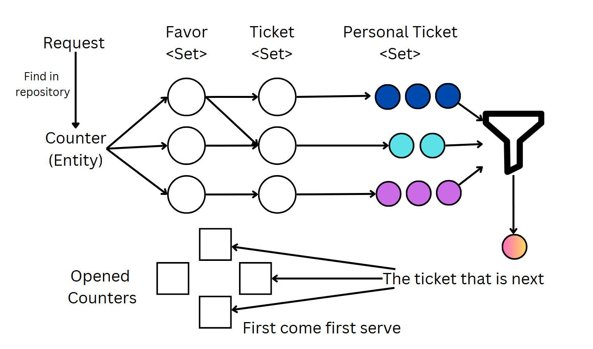

Ticket Flow is my implementation of the waiting-in-line problem. It was developed as my bachelor's thesis. In essence, the system is a way for any business to organize their line problems. The application is applicable for various businesses and will work for many unusual scenarios.

Her you can see a plain example of how the system is meant to be used. The example shows how a
administrative unit uses the system to simplify the line and waiting time.

Example 2 shows the system in a more unseal manner ware the user picks a move that they what to watch and is directed to the right auditorium.

In this flow diagram is shown how a typical user experience is conducted.

The second flow shows how the system is used by the Administrator and the process of creating a new type of ticket.

In the diagram is shown how the system is implemented as a many-to-many node system of inner connected favors and ticket types. And how the system knows witch person is next in line when you have many counted byt all of them are doing different tickets but some of them game tickets in common. This is very hard to get your head around. But in many administrative structures one counter may on 3 different favors and the counter next to it will work only 2 of the 3 favors. So as a wrap the system supports many favors all being done by a mix of counters.
