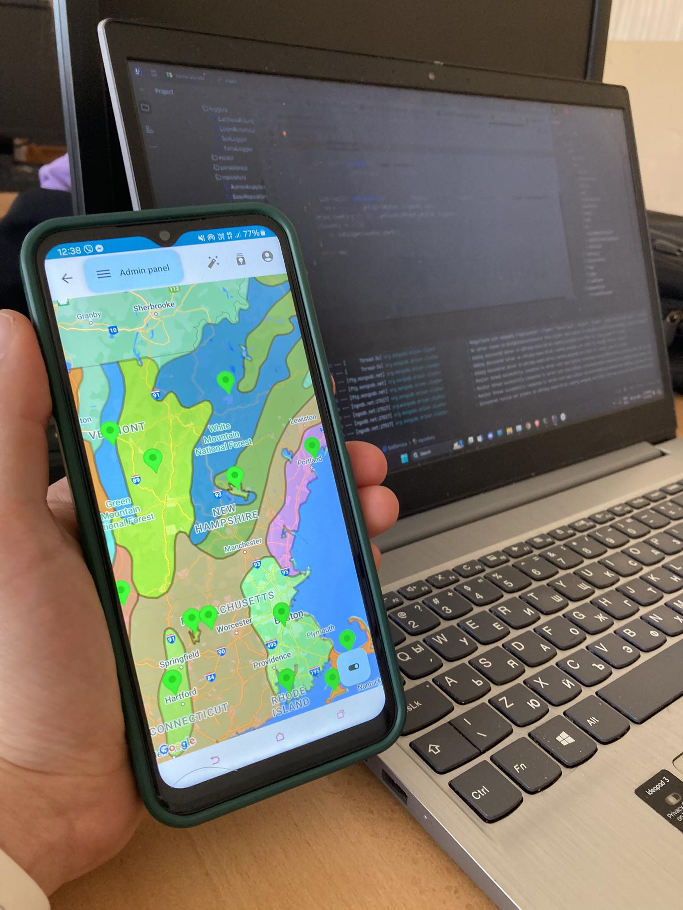
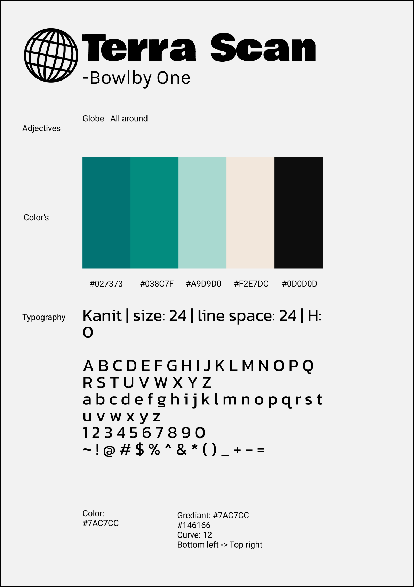

This mobile application provides real-time insights into soil types and earthquake activity. It is powered by a robust Java Spring backend, secured with Spring Security, ensuring data integrity and protection. The backend leverages PostgreSQL for data management and PostGIS for handling geospatial data. The Android frontend, built with a Single Activity architecture using Jetpack Compose, offers a seamless and dynamic user experience with multiple views. Users can explore and analyze geospatial data interactively, with up-to-date information on soil conditions and seismic events.

Live demo

---

Style Guide

# Links

[Terra scan Android Repo](https://github.com/IvoRum/Terra-Scan-Mobile)

[Terra scan Spring server Repo](https://github.com/IvoRum/Terra-Scan-Server)
